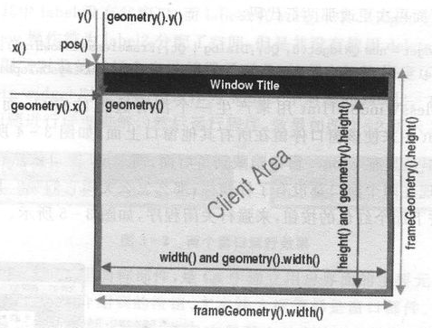

### 布局

##### Qt 窗口几何布局

* 包含框架： x(),y(),frameGeometry(),pos(),move()...
* 不包含框架：geometry(),width(),height(),rect(),size()...
* 类 QRect(x,y,width,height)

###### 布局管理器 QLayout

* QBoxLayout 基本布局管理器（撑满整个盒子）
* QGridLayout 栅格布局管理器（分隔成行和列）
* QFormLayout 表单布局管理器（两列：左标签右部件）

###### 部件大小

* QSizePolicy 大小策略（决定是否可以被拉伸、压缩）
* stretch factor 伸缩因子（影响基本布局时的比例）

###### 分裂器QSplitter
###### Buddy伙伴关系
###### Tab键顺序

##### iOS 布局

* frame 
* size
* bounds