### 窗口部件

##### QFrame

带有边框的部件的基类，子类包括

* QLabel 标签
* QLCDNumber 液晶显示
* QSplitter
* QStackedWidget 多页面
* QToolBox 层叠窗口部件

QAbstractScrollArea 带有滚动区域的部件抽象类

* QTextEdit 
* QLineEdit (自事撤销恢复、剪切拖放等操作)（示例：Line Edits）

QAbstractButton 按钮部件 （示例：Group Box Example）

* QGroupBox
* QCheckBox 复选框
* QPushButton 标准按钮
* QRadioButton 单选按钮
* QToolButton 工具按钮

QAbstractSpinBox 数值设定框

* QDateTimeEdit 日期
* QSpinBox 整数
* QDoubleSpinBox 浮点数

QAbstractSlider 滑块部件

* QScrollBar 滚动条
* QSlider 进度滑块
* QDial 刻度表

#### 比较

| 部件 | iOS | Qt |
|---|---|---|
|Views| Action Sheets  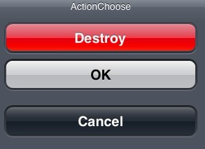| |
||Activity Indicators(菊花)  ||
||Alert Views  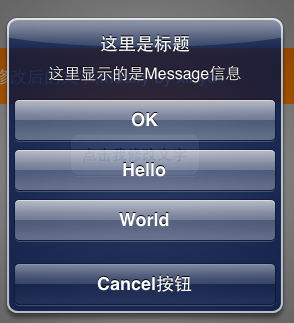||
||Collection Views  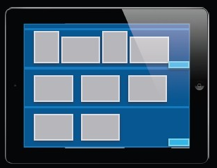||
||Image Views||
||Labels 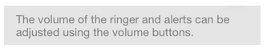| QLabel |
||Navigation Bar 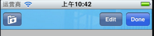||
||Picker Views  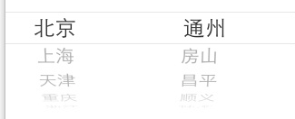| Combo Box  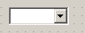|
||Progress Views 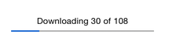| progress Bar 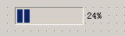|
||Scroll Views 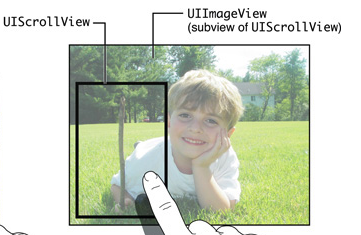|Horizontal Scroll Bar Vertical Scroll Bar 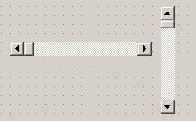 Scroll Area|
||Search Bars 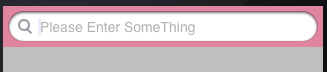||
||Tab Bars 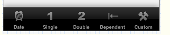||
||Table Views 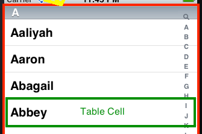||
||Text Views 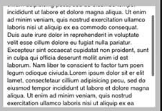|Text Browser|
||Toolbars 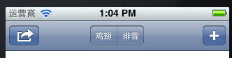||
||Web Views | QWeiView|
|Controls| Buttons  | |
||Date Pickers 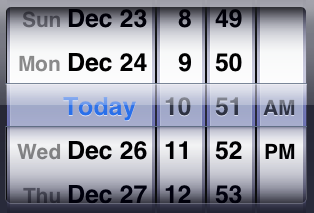| Time Edit Date Edit Date/Time Edit 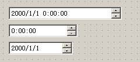 Calendar |
||Page Controls 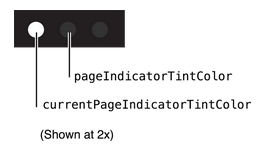||
||Segmented Controls 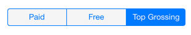||
||Sliders 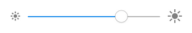| Horizontal Slider   Vertical Slider  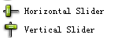|
||Steppers 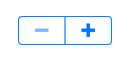||
||Switches 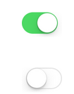||
||Text Fields 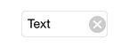| Line Edit|
|View Controller| Split View Controllers ||
|Other|fixed space bar button item 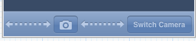| Horizontal Spacer Vertical Spacer  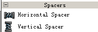|

#### 参考资料

* [About Views](https://developer.apple.com/library/ios/documentation/UserExperience/Conceptual/UIKitUICatalog/index.html#//apple_ref/doc/uid/TP40012857-UIView-SW1)
* [Swift UI控件实现大全](https://github.com/HunkSmile/Swift)