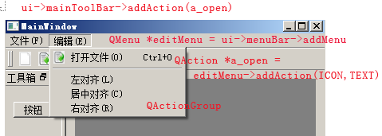

## QMainWindow 主窗口框架

* 菜单栏(QMenuBar*) : QMenu,QAction
* 工具栏(QToolBar*) : QAction(+QToolButton)
* 中心部件(Central Widget)
* Dock部件（停靠窗口）(QDockWidget)
* 状态栏(QStatusBar*)

#### 解释

* QMenuBar

由一系列的 QMenu 组成的水平栏。

* QMenu

QMenu 是用在菜单栏(menu Bars)上的菜单部件。它可以是单独的一个文字菜单，也可以以下拉菜单(在用户点击了某个特殊的项或使用快捷键)的方式呈现。

* Actions/QWidgetAction

通常一个 QMenu 是由一系列的 Action 项组成的。Actions 总共有4类，分别是
```
1.separators 分隔符 addSeparator()
2.submenu 子菜单 addMenu()
3.widgets QWidgetAction
4.actions
```

QAction类提供了一个可以同时出现在菜单和工具条上的抽象用户界面操作，并且该操作在菜单和工具条之间保持同步。QAction可以包含图标、菜单文本、快捷键、状态条文本等。一旦QAction已经被创建，它应该被添加到相应的菜单或者工具条，然后连接到执行这个操作的槽。
```
fileSaveAction = new QAction( 
	"Save File",QPixmap( filesave ),
    "&Save",CTRL+Key_S,
	this,"save"
);
connect(
	fileSaveAction,
	SIGNAL( activated() ) ,
	this,
	SLOT( save() )
);
#注意在这时还没有菜单或者工具条操作
QToolBar * fileTools = new QToolBar( this, "file operations" );
fileSaveAction->addTo( fileTools );

QPopupMenu * file = new QPopupMenu( this );
menuBar()->insertItem( "&File", file );
fileSaveAction->addTo( file );
```

层次关系：
```
QMenu * QMenuBar::addMenu ( const QString & title )
QAction * QMenu::addAction ( const QString & text )
QAction::QAction ( const QString & text)

#代码先后
QMenuBar::addMenu
QAction
QMenu::addAction(QAction);
```



