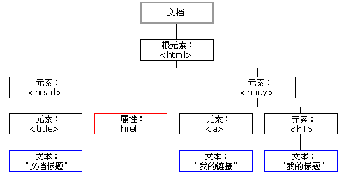
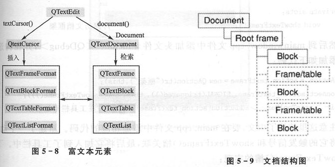

## Qt富文本

#### HTML DOM Tree

* window.document
* window.document.head
* window.document.body

#### Rich Text

一个 QTextEdit 对象包含了以下两个对象

* QTextCursor 文档光标
* QTextDocument 文档框架

文档结构

* QTextFrame 框架 <- QTextFrameFormat 框架格式
* QTextBlock 文本块 <- QTextBlockFormae 文本块格式
* QTextTable 表格 <- QTextTable 表格格式
* QTextList 列表 <- QTextListFormat 列表格式

文本块(Block)内容可以输出，框架(Frame)不可以输出

#### 其它功能

* 语法高亮
* 自动补全（需要重写 QTextEdit）
* 拖拽文件、图片

