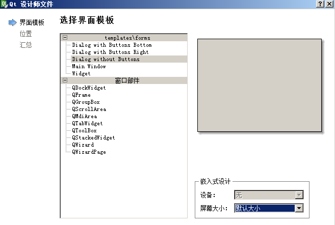
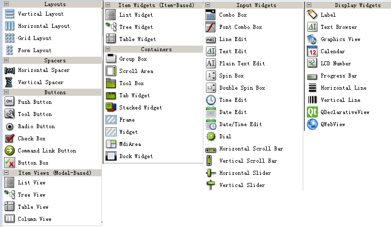
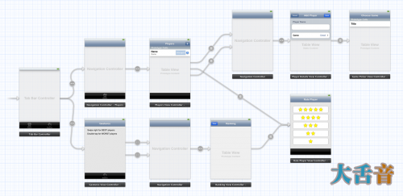
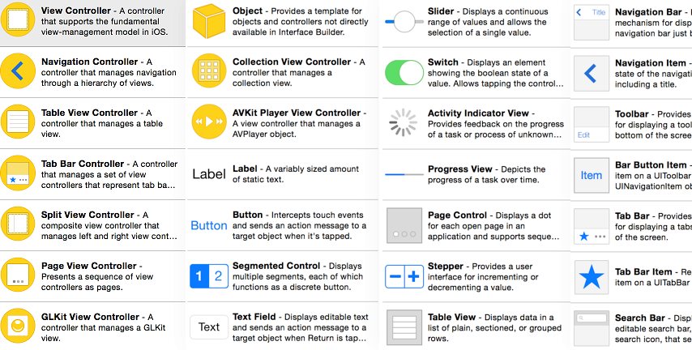

### 界面文件

#### .ui

.ui 是 Qt 中称为 "设计师界面"





.ui 在编译之后会生成一个隐藏的 ui_xxx.h 头文件(可以在过滤中取消"隐藏生成文件"让其显示)，主要内容如下

```
class Ui_emptyDialog{ #我们建立的对话框类
public:
    QLabel *label; #在对话框窗口添加的 Label 部件，以指针方式存在

    void setupUi(QDialog *emptyDialog) # setupUi 函数用来生成界面
    {
		# 设置对话框对象名称
        if (emptyDialog->objectName().isEmpty())
            emptyDialog->setObjectName(QString::fromUtf8("emptyDialog"));
        emptyDialog->resize(400, 300); #设置窗口大小
        label = new QLabel(emptyDialog); #创建标签对象
        label->setObjectName(QString::fromUtf8("label")); #设置标签对象名称
        label->setGeometry(QRect(120, 120, 151, 16)); # 设置大小及位置

        retranslateUi(emptyDialog);
		#使窗口中的部件实现按对象名进行信号关联
        QMetaObject::connectSlotsByName(emptyDialog);
    }
	#对窗口中的字符串进行编码转换
    void retranslateUi(QDialog *emptyDialog)
    {
        emptyDialog->setWindowTitle(QApplication::translate("emptyDialog", "Dialog", 0, QApplication::UnicodeUTF8));
        label->setText(QApplication::translate("emptyDialog", "Hello World!\344\275\240\345\245\275 Qt!", 0, QApplication::UnicodeUTF8));
    }

};
```

使用设计师界面后，main.cpp 的内容可以精简为

```
#include "ui_emptydialog.h"

int main(int argc,char* argv[]){
    QApplication a(argc,argv);
    QDialog w;

    Ui::emptyDialog ui; # Ui 是命名空间，在头文件中定义
    ui.setupUi(&w);

    w.show();
    return a.exec();
}
```

#### *.storyboard

Storyboard 是一个能够节省你很多设计手机App界面时间的新特性，下面，为了简明的说明Storyboard的效果，我贴上本教程所完成的Storyboard的截图：

 

现在，你就可以清楚的看到这个应用究竟是干些什么的，也可以清楚的看到其中的各种关系，这就是Storyboard的强大之处了。如果你要制作一个页面很多 很复杂的App，Storyboard可以帮助你解决写很多重复的跳转方法的麻烦，节省很多时间，以便你能够完全的专注于核心功能的实现上。 



如果不使用 storyboard，也可以通过手动创建文件创建部件，然后添加到主界面上。

#### 比较

1.*.ui 和 *.storyboard 都是一个 xml 文件

2.都可以简化界面的搭建


#### 参考资料

* [iOS Storyboard全解析](http://www.cnblogs.com/heyonggang/p/3673643.html)