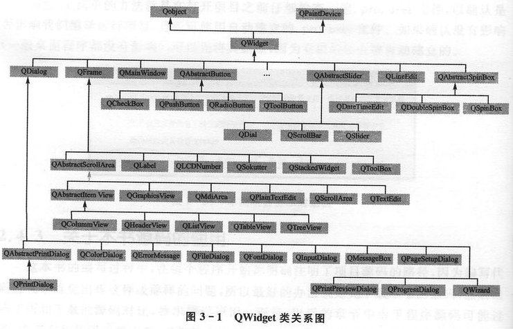
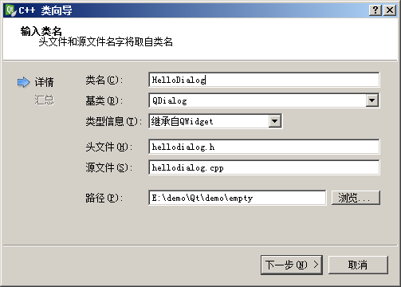
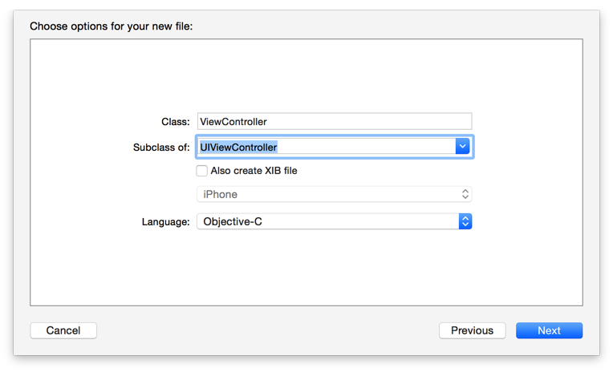

### 主窗体

<h4 id="QDialog">QWidget/QDialog</h4>



默认提供基类只有3种

* QMainWindow : 带菜单栏和工具栏的主窗口类
* QDialog : 对话框基类
* QWidget : 所有窗口部件的基类

##### QWidget

基础窗口部件，继承自 QObject (Qt 对象模型基类) 和 QPaintDevice (Qt 绘制对象基类)

窗口是指没有嵌入到其他部件中的部件（通常构造函数中 parent 参数为 0），一般窗口都有边框和标题栏。

##### QDialog

QDialog 类是所有对话框窗口的基类。

对话框窗口是主要用于短期任务以及和用户进行简单交互的 **顶级窗口** 。QDialog 可以是 **模式** 的也可以是 **非模式** 的。QDialog 支持扩展性并且可以 **提供返回值** 。


这里有三种有用的对话框：

**模式对话框** 就是 **阻塞同一应用程序中其它可视窗口的输入的对话框** ：用户必须完成这个对话框中的交互操作并且关闭了它之后才能访问应用程序中的其它任何窗口。模式对话框有它们自己的本地事件循环。用来 **让用户选择一个文件** 或者用来 **设置应用程序参数** 的对话框通常是模式的。调用 **exec()** 来显示模式对话框。当用户关闭这个对话框，exec()将提供一个可用的 **返回值** 并且这时流程控制继续从调用exec()的地方进行。通常，我们连接默认按钮，例如“OK”到accept()槽并且把“Cancel”连接到reject()槽，来使对话框关闭并且返回适当的值。另外我们也可以连接done()槽，传递给它Accepted或Rejected。

**非模式对话框** 是和同一个程序中 **其它窗口操作无关** 的对话框。在字处理软件中查找和替换对话框通常是非模式的来允许同时与应用程序主窗口和对话框进行交互。调用 **show()** 来显示非模式对话框。show()立即返回，这样调用代码中的控制流将会继续。在实践中你将会经常调用show()并且在调用show()的函数最后，控制返回主事件循环。

**半模式对话框** 是立即把控制返回给调用者的模式对话框。半模式对话框没有它们自己的事件循环，所以你将需要周期性地调用QApplication::processEvents()来让这个半模式对话框有处理它的事件的机会。 **进程对话框**（例如QProgressDialog）就是一个实例，在你想让用户能够和进程对话框交互的地方那个，例如撤销一个长期运行的操作，但是需要实际上执行这个操作。半模式对话框模式标记被设置为真并且调用show()函数来被显示。

```
//设置窗口大小
QDialog w;
w.resize(400,300);
QLable label(&w);
label.move(120,120);
```

##### QMainWindow 主窗口框架

* 菜单栏(QMenuBar*) : QMenu,QAction
* 工具栏(QToolBar*) : QAction(+QToolButton)
* 中心部件(Central Widget)
* Dock部件（停靠窗口）(QDockWidget)
* 状态栏(QStatusBar*)

```
#状态栏3类信息
临时消息：如提示信息，showMessage()
正常消息：如页数行号，addWidget(QLable *)
永久消息：如版本号日期，addPermanentWidget(QLable *)
```

<h4 id="UIWindow">iOS:UIWindow</h4>

UIWindow是一种特殊的UIView，通常在一个app中 **只会有一个** UIWindow

iOS程序启动完毕后，创建的 **第一个** 视图控件就是UIWindow，接着创建控制器的view，最后将控制器的view添加到UIWindow上，于是控制器的view就显示在屏幕上了

一个iOS程序之所以能显示到屏幕上，完全是因为它有UIWindow。也就说，没有UIWindow，就看不见任何UI界面


```
// 设置app尺寸
self.view = [[UIView alloc] initWithFrame:[UIScreen mainScreen].applicationFrame];
// 状态栏尺寸
[[UIApplication sharedApplication] statusBarFrame];
// 屏幕尺寸
[[UIScreen mainScreen].bounds];
```

#### 比较
1.窗体大小

Qt 通过 QDialog resize(width,height) 直接设置

iOS 通过设置 view 的 frame 间接设置屏幕大小

2.尺寸大小

Qt 中的 QSize 类可以用来定义一个尺寸，比如 `QSize size(400,300)`，当然也有一个跟 iOS 很像的类 `QRect(120, 120, 151, 16)` 用来定义尺寸及位置 ;

iOS 中的 `CGRectMake(CGFloat x, CGFloat y, CGFloat width, CGFloat height) `方法也具有同样的功能，其中 `x,y 属于 origin 属性，width,height 属于 size 属性`


#### 添加类 Qt


* 建立类（相当于iOS的ViewController），继承自 QDialog，（通过 show() 被调用）
* 包含界面ui的头文件（运行项目时会自动生成）
* 在该类中定义指向 ui类 的指针，并通过 `ui->setupUI(this)` 并实现关联
* 通过该指针操作 ui 里的界面部件

#### 添加类 iOS


#### 比较

在 iOS 中，是通过 `window.RootViewController -> controller -> view -> 部件` ，让部件显示在屏幕之上。

在 Qt 中，一个 QDialog 类相当于 iOS 中的 `window + controller + view`


#### 参考资料

[iOS开发UI篇—UIWindow简单介绍](http://www.cnblogs.com/wendingding/p/3770052.html)