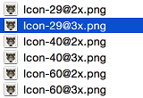
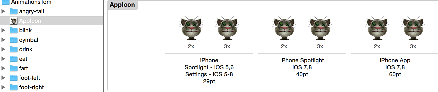
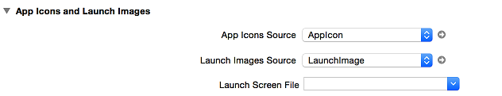

## 应用程序图标

* Qt

在帮助文档中搜索 "Setting the Application Icon" 可以找到设置应用程序图标的示例。

1.自已制作或者从网上下载一个 ico 图片，存储到项目文件夹下，命令为 1.ico 

注意：如果你的 ico 图片有问题（通常都是自己制作引起的），那么运行的时候可能会报错：[release/myapp_res.o] Error 1

2.新建文件 xxx.rc ，内容如下

`IDI_ICON1	ICON	DISCARDABLE	"1.ico"`

3.打开项目配置文件 .pro ，追加以下代码

`RC_FILE = myapp.rc`

4.再次运行程序，通常就可以看到设置的图标了（同时 .exe 程序的图标也会改变的哦）

* iOS

1.为同一张图片准备不同尺寸的图片，并且按规定进行命名


```
如上图的 29@2x.png 即是 58px * 58px
60@3x.png 即是 180px * 180px
```

2.打开项目下的 Images.xcassets ，将图片拖放到 AppIcon 下对应的位置



3.设置应用程序的配置



4.运行程序，OK